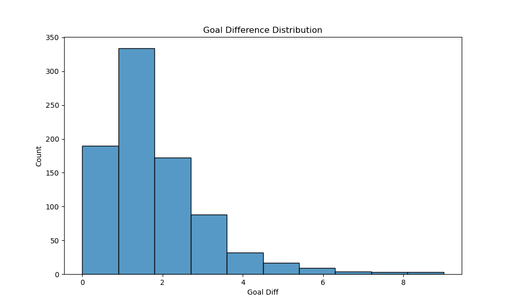

# FIFA World Cup Data Analysis (1930–2014)

## Project Overview
This project analyzes historical FIFA World Cup match data to uncover patterns, trends, and insights related to match outcomes, scoring behavior, and audience engagement.

---

## Objectives
- Clean and preprocess raw data  
- Handle missing values and remove inconsistencies  
- Perform exploratory data analysis (EDA)  
- Visualize key trends and patterns  
- Extract meaningful insights  

---

## Tools & Technologies
- Python  
- Pandas  
- NumPy  
- Matplotlib  
- Seaborn  
- Jupyter Notebook  

---

## Data Cleaning
- Removed rows with missing match data  
- Converted goals to integer values  
- Handled missing attendance values  
- Dropped irrelevant columns  

---

## Key Visualizations

### Goal Difference Distribution

### Match Outcomes

### Attendance Trends

### Top Scoring Teams

---

## Key Insights

- Most matches are closely contested, with a goal difference of 1–2  
- Home teams win more matches, indicating a home advantage  
- World Cup attendance has increased over time  
- High-scoring matches are relatively rare  

---

## Project Structure

## Key Learnings

- Importance of data cleaning in real-world datasets  
- Handling missing values and outliers  
- Extracting insights using EDA  
- Communicating findings using visualizations  
